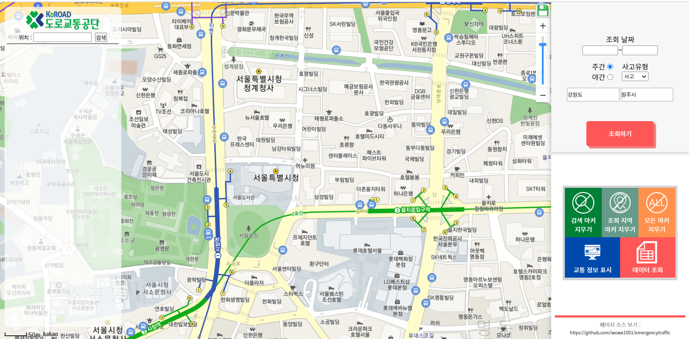

# 도로교통공단 인턴 긴급교통정보 웹페이지

### 프로그램 목적
* 사용자가 사고, 공사, 행사 등과 관련된 긴급 교통정보 입력  
-> 쌓인 데이터는 기존 긴급교통정보 데이터와 병합되어 본부마다 다량의 데이터가 확보(지역 본부별 DB구축은 미완성)  

* 이후 저장된 데이터는 사용자가 필요한(긴급) 정보를 편리하게 관리 및 조회할 수 있도록 하나의 웹 애플리케이션을 구축하였음.  

### 같이 보면 좋은 것들
- cd, ls, mkdir 등 기본 리눅스 명령어
- flask 기초

## 1. 개발 환경 구성
- python3(flask 가상환경), mysql(or mariadb), 웹 서버(무료 아마존 ec2를 사용하였음)
#
## 2. 파일 구성
> 1) main.py : 서버 구동을 위한 파일
> 2) loginmysql.py : mysql/maraidb 로그인과 클라이언트의 요청으로 부터 서버의 데이터를 편집을 위한 모듈
> 3) static : 가상환경이 렌더링할 페이지의 css와 자바스크립트파일/ 이미지 모음
> 4) templates : flask 가상환경이 렌더링할 페이지
> 5) createdb.sql : DB 초기 세팅을 위해 스키마와 테이블을 생성하는 sql
> 6) requirements.txt : 파이썬 필요 라이브러리 정리 목록  
#
## 3. 서버 실행 단계(아마존 ec2를 통한 구축방법)
#### &nbsp;&nbsp;&nbsp;&nbsp; (1) 클라우드 서버 컴퓨터에 python/conda, mysql, git 설치  
#### &nbsp;&nbsp;&nbsp;&nbsp; * _구글 검색 : AWS EC2에 플라스크 클라우드 웹 서버 구축하기 / git 설치 명령어 : sudo apt install git_  
#### &nbsp;&nbsp;&nbsp;&nbsp; (2) git 설치 후 명령어 타이핑 / _ 명령어 : git clone https://github.com/wowx1001/emergencytraffic _  
#### &nbsp;&nbsp;&nbsp;&nbsp; (3) requirements.txt를 통해 요구된 라이브러리를 설치 _ cmd 명령어 : pip install -r 경로/requirements.txt _  
#### &nbsp;&nbsp;&nbsp;&nbsp; (4) mysql 실행 뒤 콘솔 환경의 경우 source '경로/create.sql' 입력  
#### &nbsp;&nbsp;&nbsp;&nbsp; (5) https://apis.map.kakao.com/ 에서 카카오 맵 api 키 발급후 templates/main.html에 api키를 수정  
#### &nbsp;&nbsp;&nbsp;&nbsp; (6) https://developers.kakao.com/ -> 내 애플리케이션 -> 플랫폼 Web 플랫폼 등록 및 Web 사이트 도메인에 아마존 ec2 ipv4 주소와 포트를 추가.(ex.http://127.0.0.1:5000)  
#### &nbsp;&nbsp;&nbsp;&nbsp; (7) main.py의 host 부분을 자신의 고정 ip에 맞게 수정  _[클라우드 환경일 경우 host="0.0.0.0"]_  
#### &nbsp;&nbsp;&nbsp;&nbsp; (8) root 디렉토리에서 flask source/bin/activate 명령어 타이핑 후 main.py가 있는 폴더에서 python3 main 타이핑  

#
## 4. 실행 화면
### (홈)초기화면 </img>
---------------------------------------------------------------
### 검색화면 </img>
---------------------------------------------------------------
### 검색화면 입력 폼(지도의 원하는 위치를 클릭하여 마커를 표시하고 입력할수있음) </img>
---------------------------------------------------------------
### 입력 후 결과를 테이블로 조회 </img>
---------------------------------------------------------------
### 지역별 조회 </img>
---------------------------------------------------------------
### 지역별 조회 결과(지도) </img>
---------------------------------------------------------------
### 지역별 조회 결과(테이블) </img>
---------------------------------------------------------------
### 교통정보표시/해제 (버튼을 다시 클릭 할 경우 숨기기) </img>
---------------------------------------------------------------
### 우측 상단의 파일 아이콘을 클릭하여 파일 저장 </img>
---------------------------------------------------------------
### csv 저장 결과 </img>

## 5. 고안
##### - 웹의 간단한 기능만 구현했기 때문에 이후 필요한 고도화 작업 필수
##### - https://developers.kakao.com/ 에서 특정 주소에서 접속할 수 있게 하는 옵션이 있음

